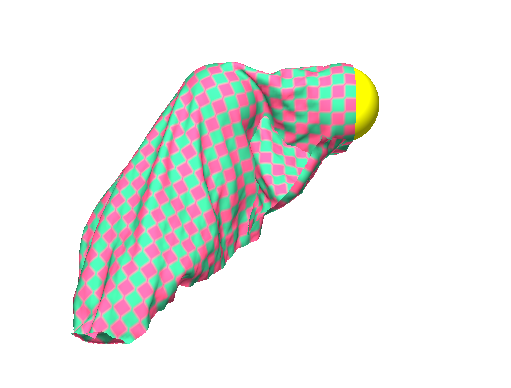
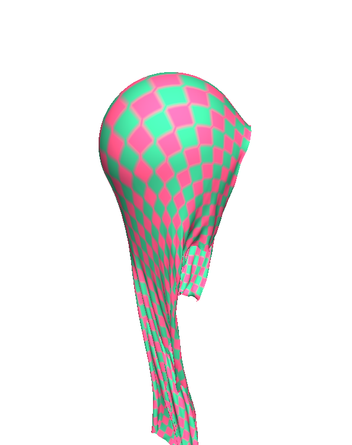
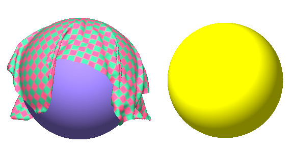
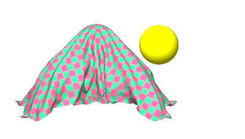

Example:

<p align="center">
  
</p>

----

# My work

为了便于调试，新增按键：按 s 暂停

```
paused = ti.field(dtype=ti.i32, shape=())
paused = False
while window.running:
    if window.get_event(ti.ui.PRESS):
        if window.event.key == 's':
            paused= not paused
```


##  Easy: 更改物理参数

调整不同的参数

将杨氏模量调整缩小100倍


效果为：布料伸缩性非常好




调整dashpot_damping

调大100倍：直接模拟不出来布料。

调小100倍：很难观察出明显效果


调整dt

调大100倍：布料在初始位置卡住不动

调小100倍：肉眼可见卡顿和帧率下降(12fps左右)


## Easy: 更改 vsync

更改 vsync=False

去掉帧率限制后

帧率达到350+


可见模拟显示速度也加快了

（类似快进效果）


## Medium

**不会被刺穿**：暂时不会。

**添加更多球**


其一是要画出来球（视觉上），其二是要仿真中有球（可碰撞）


### 视觉上加入第二个球

这段代码显然是用来画球的

```
scene.particles(ball_center, radius=ball_radius * 0.95, color=(0.5, 0.42, 0.8))
```

我们可对其进行略微修改，偏移一些距离画出第二个球

```
ball_center2 = ti.Vector.field(3, dtype=float, shape=(1, ))
ball_center2[0] = [0.3, 0, 0]
...

scene.particles(ball_center, radius=ball_radius * 0.95, color=(0.5, 0.42, 0.8))
scene.particles(ball_center2, radius=ball_radius * 0.95, color=(1, 1.0, 0.0))
```




显然布料太小，球太大，看不到覆盖的效果。我们要么把布料调大，要么把球调小。我们这里采用后者。

```
ball_radius = 0.1
```




黄色的球还没加到仿真里，所以还没法碰撞。


问题1解决了，也就是视觉上有了第二个球。现在处理问题2：加入仿真。


### 仿真上加入第二个球

搜索ball相关的代码，显然这段代码是最相关的

```
    for i in ti.grouped(x):
        v[i] *= ti.exp(-drag_damping * dt)
        offset_to_center = x[i] - ball_center[0]
        if offset_to_center.norm() <= ball_radius:
            # Velocity projection
            normal = offset_to_center.normalized()
            v[i] -= min(v[i].dot(normal), 0) * normal
        x[i] += dt * v[i]
```

我们分析一下这段代码

x和v显然针对的是布料的网格点（或者说质点）

offset_to_center显然就是质点对球心的距离

if语句中，假如质点对球心的距离小于球半径（也就是质点在球内部）, 那么就更新速度。

我们的想法是增加一个球。因此只要修改if语句和offset_to_center即可。不破坏原有代码，在这两个语句下面平行地增加代码：

```
    for i in ti.grouped(x):
        v[i] *= ti.exp(-drag_damping * dt)
        offset_to_center = x[i] - ball_center[0]
        if offset_to_center.norm() <= ball_radius:
            # Velocity projection
            normal = offset_to_center.normalized()
            v[i] -= min(v[i].dot(normal), 0) * normal

        offset_to_center2 = x[i] - ball_center2[0]
        if offset_to_center2.norm() <= ball_radius:
            # Velocity projection
            normal2 = offset_to_center2.normalized()
            v[i] -= min(v[i].dot(normal2), 0) * normal2        
        x[i] += dt * v[i]
```


这下两个球都可以碰撞了。


## Hard

暂时还没做。


